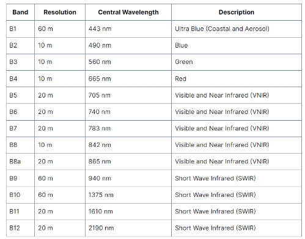
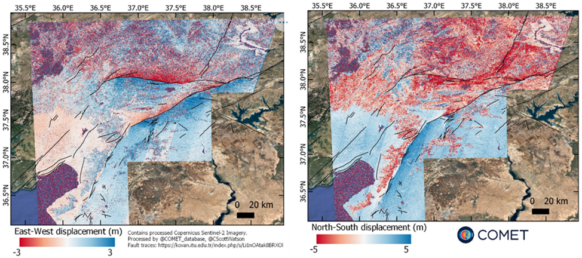
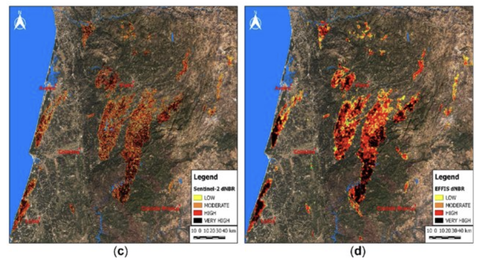
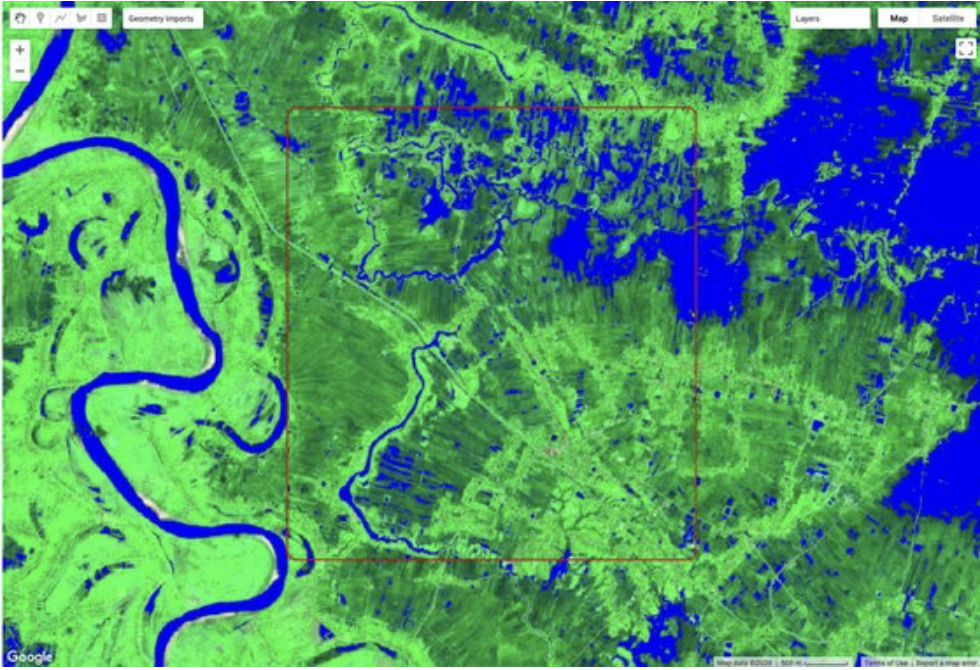
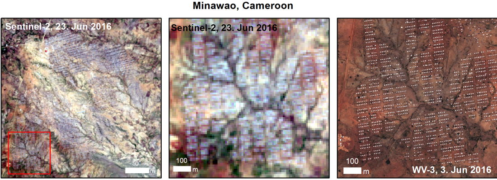

```{r setup, include=FALSE,echo=FALSE}
options(htmltools.dir.version = FALSE)
library(dplyr)
library(readr)
library(readxl)
library(knitr)
```

```{r xaringan-themer, include=FALSE, warning=FALSE}
library(xaringanthemer)
style_duo_accent(primary_color = "#0D5E74", 
                 # secondary_color = "#2881C6",
  header_font_google = google_font("Josefin Sans"),
  text_font_google   = google_font("Montserrat", "300", "300i"),
  code_font_google   = google_font("Fira Mono"),
)
```

```{r xaringan-all, echo=FALSE, warning=FALSE}
library(countdown)
library(xaringan)
library(xaringanExtra)
hook_source <- knitr::knit_hooks$get('source')
knitr::knit_hooks$set(source = function(x, options) {
  x <- stringr::str_replace(x, "^[[:blank:]]?([^*].+?)[[:blank:]]*#<<[[:blank:]]*$", "*\\1")
  hook_source(x, options)
})
xaringanExtra::use_broadcast()
xaringanExtra::use_freezeframe()
xaringanExtra::use_scribble()
#xaringanExtra::use_slide_tone()
xaringanExtra::use_search(show_icon = TRUE, auto_search	=FALSE)
xaringanExtra::use_freezeframe()
xaringanExtra::use_clipboard()
xaringanExtra::use_tile_view()
xaringanExtra::use_panelset()
xaringanExtra::use_editable(expires = 1)
xaringanExtra::use_fit_screen()
xaringanExtra::use_extra_styles(
  hover_code_line = TRUE,         
  mute_unhighlighted_code = TRUE  
)
```

```{r setupbibliography, include=FALSE}
# Code supplied by Andy (see wk2 slides 25-28)
library(RefManageR)
library(knitcitations)
BibOptions(check.entries = FALSE,
           bib.style = "authoryear",
           cite.style = "authoryear",
           style = "markdown",
           hyperlink = TRUE,
           dashed = FALSE,
           no.print.fields=c("doi", "url", "urldate", "issn"))
myBib <- ReadBib("bib.bib",
                 check = FALSE)
```

class: center, title-slide, middle

background-image: url("media/Sentinel2background.jpeg")
background-size: cover
background-position: center

# Sentinel 2
### Mindy Ng

---
class: inverse, center, middle

# Summary

---

# Quick Facts

- **Type**: Optical (passive)

- **Aim**: Monitoring variability in land surface conditions

- **What**: 2 identical satellites in the same orbit phased at 180° to each other

- **Revisit time**: 10 days at the equator with 1 satellite, 5 days with 2 satellites at mid-latitudes (staggered meaning it’s every 2-3 days)

Source: `r Citet(myBib, "SENTINEL2MISSIONGUIDE")`

---
class: center, middle

# Mission: To collect multispectral high resolution images with high temporal frequency to contribute to efforts in climate change, land monitoring, emergency management, and security.

---

# Launch Dates

### Sentinel-2A: June 23, 2015
### Sentinel-2B: March 7, 2017

Source: `r Citet(myBib, "SENTINEL2MISSIONGUIDE")`

---

# Spectral and Spatial Resolutions
    
```{r bands_img, echo=FALSE, out.width='60%', fig.align='center'}

```
Source: Practical 1 (Andy MacLachlan)
---

class: inverse, center, middle

# Applications

---

class: center, middle

## Sentinel-2 data can be useful in many contexts, including: 
### agriculture
### land ecosystems monitoring
### forest management 
### inland and costal water quality monitoring
### disaster mapping and civil security

---

class: center, middle

# Let's focus on disaster mapping!

## We'll look at how it's used for various types of disasters

---

# Earthquakes
- Identifying at-risk buildings to be upgraded (prevention) or assessing damage and identifying areas with most need for aid 
- Calculating the difference pre and post event images to estimate ground movement
- Often combined with Sentinel-1 SAR data


```{r earthquake_img, echo=FALSE, out.width='60%', fig.align='center'}

```
Caption: Combined Sentinel-1 and Sentinel 2 data to assess damage in Turkey-Syria Earthquake

Source: `r Citet(myBib, "lucyTurkiyeSyriaEarthquakesFebruary2023")`


---

# Wildfires
- Predicting behavior, assessing damages, and coordinating prevention
- Can monitor land surface temperature with short wave infrared bands 11 and 12 which are heavily reflected by heated areas and can penetrate atmosphere (the thick smoke)
    - Can map vegetation with near infrared band 8

```{r fires_img, echo=FALSE, out.width='50%', fig.align='center'}

```
Caption: dNBR image of portugal wildfires

Source: `r Citet(myBib, "llorensMethodologyEstimateForest2021")`

---

# Flooding
- Assessing extent and location of flooding using 10m visible bands to coordinate aid, rehabilitation, and possible prevention measures

```{r flood_img, echo=FALSE, out.width='50%', fig.align='center'}

```
Caption: Sentinel-2 Imagery from a flood in Nigeria. Cloud shadows, like in this image, are sometimes confused for water by water detection algorithms.

Source: `r Citet(myBib, "bonafiliaSen1Floods11GeoreferencedDataset2020a")`

---
class: center, middle

# A few other types include...

### Hurricanes and droughts (can use moisture and vegetation indices)

---
# Another cool application: Monitoring refugee camps

- Monitoring expansion and shrinkage of refugee camps for better refugee population estimates

    - The high temporal resolution allows a monitoring of population at regular, frequent intervals
    
- Assessing environmental conditions in the areas surrounding the camps

    - has been used to refute claims that camps are disproportionately causing environmental degredation.
    
- Which camps are most at risk of extreme climate conditions and where can they be relocated?

---

class: inverse, center, middle

# Reflections

---

# What I learned / Future uses 1

On February 6, 2023, Turkey and Syria were hit with a 7.8 magnitude earthquake and a 7.5 magnitude aftershock that have killed over 47,000 people so far and devastated the region. Despite the earthquake being a natural disaster, many are calling it a human-made disaster: “Earthquakes don’t kill people, buildings do”. That the failure of the government to upgrade at-threat buildings to earthquake-safe standards (disproportionately located in areas with high ethnic minorities) is the reason for this. As the government fails to provide relief to the areas worst hit, humanitarian aid organisations from countries like Greece, Armenia, and Japan have stepped in. The use of sentinel-2 data can help these organisations identify the areas with the greatest need, objectively, without the political biases that govern where the state distributes its aid. 


---
# What I learned / Future uses 2

Sentinel 2 data is often used in conjunction with data from other satellites: namely, Sentinel-1 (SAR) and various WorldView satellites

In this example, Refugee camps in Minawao, Cameroon are located within large areas of land using Sentinel-2. Once located, WideView-3 imagery is used on those specific areas, because it sees smaller areas at higher resolution.

```{r refugeecampsimg, echo=FALSE, out.width='50%', fig.align='center'}

```
Source: `r Citet(myBib, "SpaceTechnologyImproves2019")`

---

# References

Bonafilia, D. et al. (2020) Sen1Floods11: a georeferenced dataset to train and test deep learning flood algorithms for Sentinel-1, p. 845. Available at: https://doi.org/10.1109/CVPRW50498.2020.00113.

Llorens, R. et al. (2021) ‘A methodology to estimate forest fires burned areas and burn severity degrees using Sentinel-2 data. Application to the October 2017 fires in the Iberian Peninsula’, International Journal of Applied Earth Observation and Geoinformation, 95, p. 102243. Available at: https://doi.org/10.1016/j.jag.2020.102243.

Lucy (2023) Türkiye-Syria Earthquakes, February 2023, Centre for the Observation and Modelling of Earthquakes, Volcanoes and Tectonics. Available at: https://comet.nerc.ac.uk/turkiye-syria-earthquakes-february-2023/ (Accessed: 22 March 2023).

The European Space Agency (2019) Space technology improves conditions for refugees, The European Space Agency. Available at: https://www.esa.int/Enabling_Support/Preparing_for_the_Future/Space_for_Earth/Space_technology_improves_conditions_for_refugees (Accessed: 22 March 2023).

The European Space Agency (no date) SENTINEL-2 MISSION GUIDE, The European Space Agency. Available at: https://sentinel.esa.int/web/sentinel/missions/sentinel-2 (Accessed: 22 March 2023).


```{r bibliography, results='asis', echo=FALSE, warning=FALSE}
# PrintBibliography(myBib
#                   , start = 1, end = 5
#                   )
```